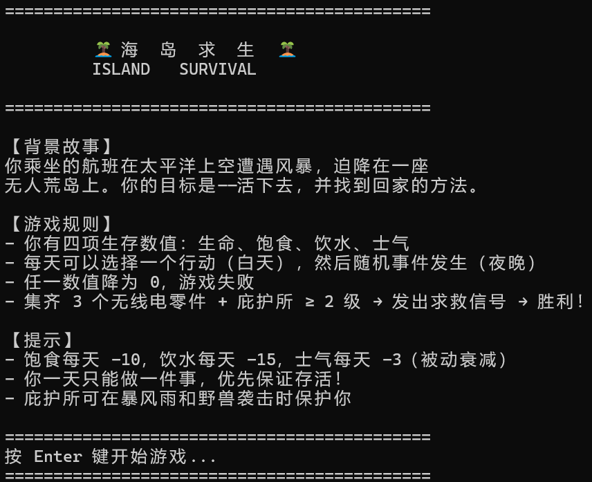
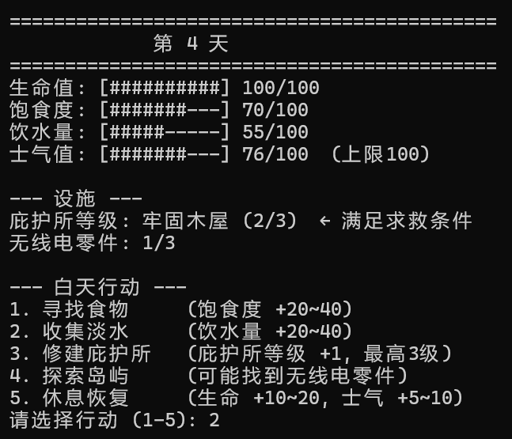
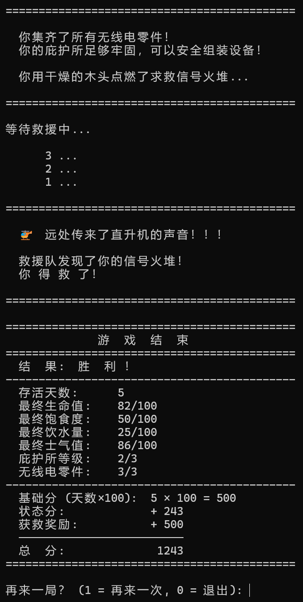
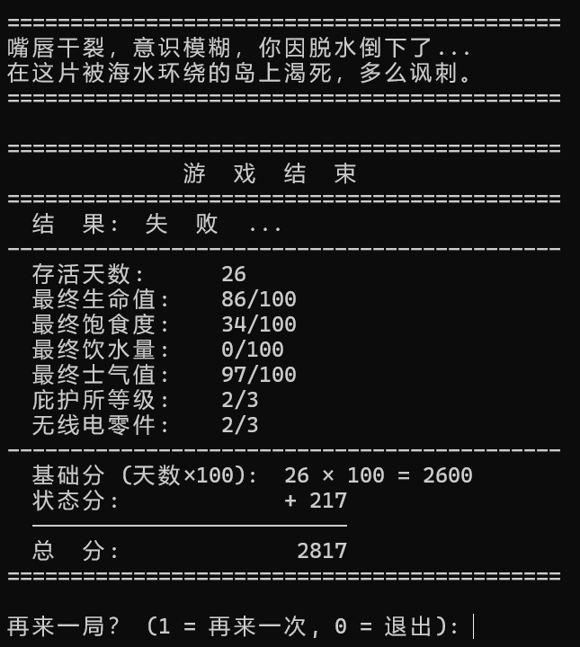

# 海岛求生 (Island Survival)

> C++ 控制台交互游戏 — 课程作业

## 游戏简介

玩家乘坐的航班在太平洋上空遭遇风暴，迫降在一座无人荒岛上。你需要管理**生命值**、**饱食度**、**饮水量**、**士气值**四项生存数值，白天选择行动（寻找食物、收集淡水、修建庇护所、探索岛屿、休息恢复），夜晚经历随机事件（暴风雨、野兽袭击、星空之夜等），集齐 3 个无线电零件并搭建 2 级以上庇护所即可点燃信号火获救。

## 游戏截图

### 标题画面


### 游戏中 — 状态栏与行动菜单


### 夜间随机事件


### 胜利结局


### 失败结局


## 编译与运行

```bash
g++ -Wall -Wextra -fexec-charset=UTF-8 -o island_survival.exe island_survival.cpp
./island_survival.exe
```

> 使用 `-fexec-charset=UTF-8` 确保中文在 Windows 控制台正常显示。

## 控制语句使用

| 语句 | 使用位置 |
|------|---------|
| `while` | 外层重玩循环、内层每日循环、坏输入消费循环 |
| `do-while` | 行动菜单输入验证、重玩询问输入验证 |
| `switch` | 白天行动选择（5 个 case + default） |
| `if-else` | 夜间随机事件判定、死亡条件检测、胜利条件检测、数值钳制 |
| `for` | 四项数值进度条绘制、获救倒计时动画 |
| `break` | 各 switch case 退出、胜利后跳出日循环 |
| `continue` | 死亡后跳过夜间阶段、夜间死后跳过胜利检测 |

## 游戏规则

- **胜利条件**：集齐 3 个无线电零件 + 庇护所等级 ≥ 2 → 点燃信号火 → 获救
- **失败条件**：生命值 / 饱食度 / 饮水量 / 士气值 任一归零
- **每日衰减**：饱食度 -10 / 饮水量 -15 / 士气值 -3（不可逆转）
- **得分**：存活天数 × 100 + 四项数值 + 获救奖励 500

## 文件结构

```
├── island_survival.cpp   # 游戏源代码（单文件，所有逻辑在 main() 中）
├── Pictures/             # 游戏运行截图
│   ├── 标题画面.png
│   ├── 游戏中.png
│   ├── 夜间事件.png
│   ├── 胜利结局.png
│   └── 游戏失败.png
└── README.md
```

## 设计亮点

- 自创生存类主题，非传统猜数字/石头剪刀布
- 资源管理的策略深度：每日只能做一个行动，但两项资源同时衰减，迫使玩家权衡
- 庇护所成长机制：既可解锁胜利条件，又在暴风雨/野兽袭击中提供减伤保护
- 随机事件系统：4 种夜间事件各有不同的风味文字和机制互动
- 文本进度条可视化：四项数值用 `[####----]` 风格显示，直观清晰
- 7 种控制语句全覆盖，每种都有自然的语义合理性，无"为了用而用"
